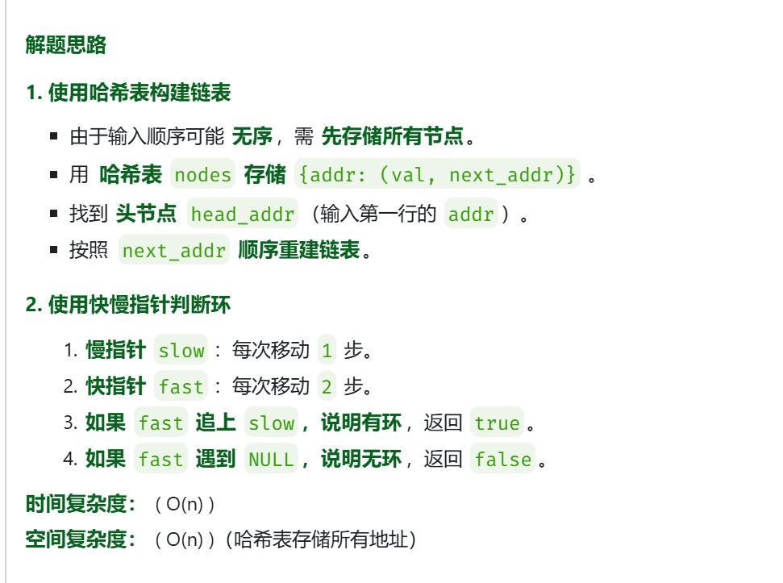

[141. 环形链表 - 力扣（LeetCode）](https://leetcode.cn/problems/linked-list-cycle/description/?envType=study-plan-v2&envId=top-100-liked)
```java
public class Solution {
    public boolean hasCycle(ListNode head) {
        ListNode fast=head;
        ListNode slow=head;
        while(fast!=null && fast.next!=null){
            fast=fast.next.next;
            slow=slow.next;
            if(fast==slow)
                return true;
        }
        return false;
    }
}
```

acm模式版本

[环形链表 - 题目详情 - CodeFun2000](https://codefun2000.com/p/P4043)



该题的acm模式需要自己构建环形链表，环形链表的构建的代码和其他代码如下图所示
```java
import java.util.*;

class ListNode{
    int val;
    ListNode next;
    public ListNode(int val){
        this.val=val;
    }
}
public class Main {
    public static boolean func(ListNode head){
        ListNode slow=head;
        ListNode fast=head;
        while(fast!=null && fast.next!=null){
            slow=slow.next;
            fast=fast.next.next;
            if(slow==fast)
                return true;
        }
        return false;
    }
    public static ListNode build(Map<Integer,int[]> inputMap,int headAddr){
        //存当前节点地址和对应listNode的map，用于后面查找链表是否存在该节点
        Map<Integer,ListNode> linkMap=new HashMap<>();
        int[] arr=inputMap.get(headAddr);
        //根据headAddr找到头节点
        ListNode head=new ListNode(arr[0]);
        ListNode tmp=head;
        //存头节点
        linkMap.put(headAddr,head);
        // 时刻从inputmap中查找下一个节点对应的val和nextAddr，进行构建
        int nextaddr=arr[1];
        //如果没有找到末尾
        while(nextaddr!=-1){
            //如果下一个节点以及在图中出现过，那么说明此时以及·1形成了环，
            //形成的环一定会在链表的末尾形成，所以此时只需要让当前节点指向对应的nextaddr即可,后续则不许他要读入
            if(linkMap.containsKey(nextaddr)){
                tmp.next=linkMap.get(nextaddr);
                break;
            }
            //找到地址对应的节点数据，之后建立节点，连接链表
            int[] nums=inputMap.get(nextaddr);
            ListNode node=new ListNode(nums[0]);
            linkMap.put(nextaddr,node);
            tmp.next=node;
            tmp=node;
            //更新nextaddr的值
            nextaddr=nums[1];
            //如果无环，到最后一个节点后，为-1，那么会默认最后一个节点的next为null，所以不需要赋值
        }

        return head;
    }
    public static void main(String[] args) {
        Scanner scanner=new Scanner(System.in);
        int n=scanner.nextInt();
        //如果链表没有节点，那么肯定没环
        if(n==0){
            System.out.println("false");
            return;
        }
        //因为地址是唯一标识，所以用i地址作为key，val和next作为val来构建map，之后用于构建链表
        Map<Integer,int[]> inputMap=new HashMap<>();
        //读取头节点的地址,用于接下来构造的时候找到头节点
        int headAddr=scanner.nextInt();
        int headVal=scanner.nextInt();
        int nextaddr=scanner.nextInt();
        inputMap.put(headAddr,new int[]{headVal,nextaddr});
        
        for(int i=1;i<n;i++){
            int addr=scanner.nextInt();
            int val=scanner.nextInt();
            nextaddr=scanner.nextInt();
            inputMap.put(addr,new int[]{val,nextaddr});
        }

        ListNode head=build(inputMap,headAddr);

        //检查日志
        // ListNode tmp=head;
        // while(tmp!=null){
        //     System.out.print(tmp.val+" ");
        //     tmp=tmp.next;
        // }

        System.out.println(func(head));

            
    }
}
```