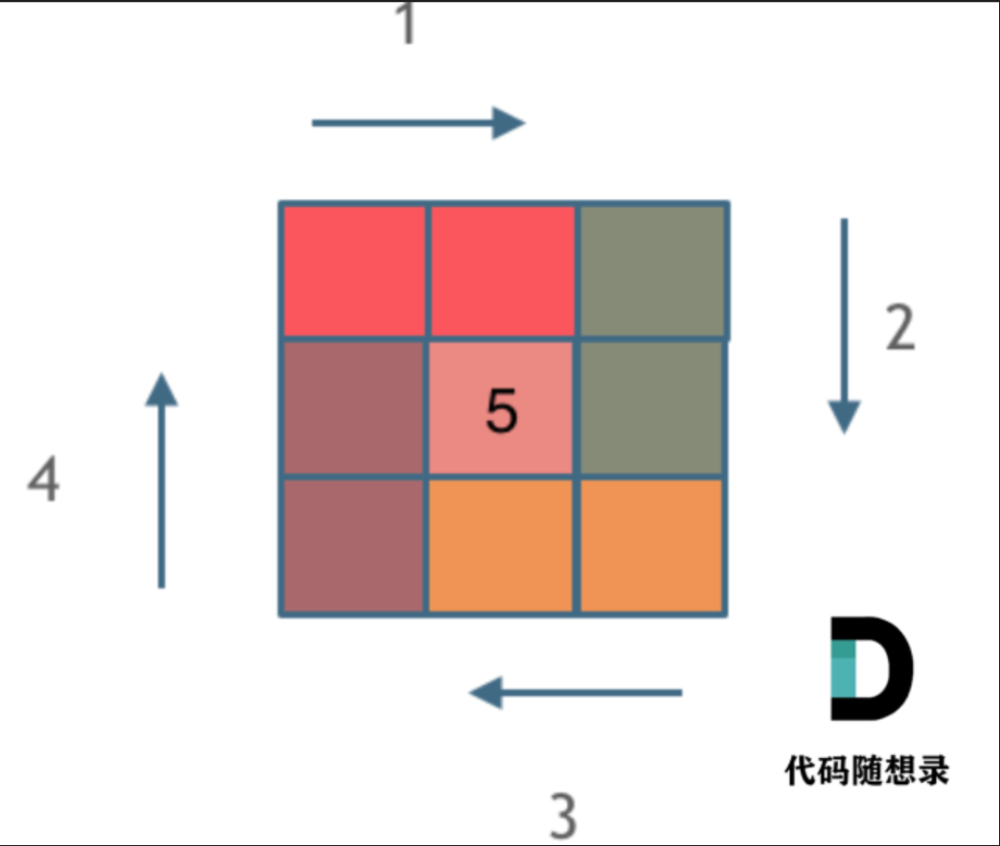

## 一、题目描述及解答
题目描述：给定一个正整数 n，生成一个包含 1 到 n^2 所有元素，且元素按顺时针顺序螺旋排列的正方形矩阵。
示例:
输入: 3 输出: \[ [ 1, 2, 3 ], [ 8, 9, 4 ], [ 7, 6, 5 ] \]

这道题目可以说在面试中出现频率较高的题目，**本题并不涉及到什么算法，就是模拟过程，但却十分考察对代码的掌控能力。**

解题思路：我们在二分查找中用到了循环不变量原则，也就是区间是左闭右闭或左闭右开，**此题依旧是坚持循环不变量原则。**
关于此题的顺时针画矩阵的过程，具体如下：
- 填充上行从左到右
- 填充右列从上到下
- 填充下行从右到左
- 填充左列从下到上
那么这样一圈下来，每次都要画四条边，这四条边怎么画，每画一条边都要坚持一致的**左闭右开**，或者左开右闭的原则，这样这一圈才能按照统一的规则画下来。本题的解法为左闭右开，那么画出来的一圈大概是如下图所示  

左闭右开，即每次只画左边第一个，右边最后一个不画，留给下一步来画。那么对于最中间的情况，我们只需要画完所有圈后在所有for循环后，单独处理即可。
	这边不知道具体代码没关系，只要理解左闭右开是怎么运行的就好。我们结合下面的代码再来详细代码理解就可以知道具体的代码逻辑。具体代码如下所示。
```c
int** generateMatrix(int n, int* returnSize, int** returnColumnSizes) {
    //初始化返回的结果数组的大小
    *returnSize = n;
    *returnColumnSizes = (int*)malloc(sizeof(int) * n);
    //初始化返回结果数组ans
    int** ans = (int**)malloc(sizeof(int*) * n);
    int i
    for(i = 0; i < n; i++) {
        ans[i] = (int*)malloc(sizeof(int) * n);
        (*returnColumnSizes)[i] = n;
    }
    /********下面采用左闭右开的方法去循环*********/
    //一圈循环的开始位置，X为横坐标，y为纵坐标
    int startX=0;
    int startY=0;
    //循环的圈数
    int loop=n/2;
    //需要控制每一条边遍历的长度，每次循环右边界收缩一位
    int offset=1;
    //矩阵的每一个空格的值
    int count=1;
    //i已经定义过
    int j;
    while(loop--){
        for(j=startY;j<n-offset;j++)
            ans[startX][j]=count++;
        for(i=startX;i<n-offset;i++)
            ans[i][j]=count++;
        for(;j>startY;j--)
            ans[i][j]=count++;
        for(;i>startX;i--)
            ans[i][j]=count++;
        startX++;
        startY++;
        offset++;
    }
    if(n%2)
        ans[n/2][n/2]=count;
    return ans;
}
```

```java
class Solution {
    public int[][] generateMatrix(int n) {
        int[][] nums=new int[n][n];
        int mid=n/2;
        int offset=0;
        int count=1;
        int startx=0;
        int starty=0;
        //左闭右开
        int i,j;
        while(mid-->0){
            for(i=starty;i<n-1-offset;i++)
                nums[startx][i]=count++;
            for(j=startx;j<n-1-offset;j++)
                nums[j][i]=count++;
            for(;i>starty;i--)
                nums[j][i]=count++;
            for(;j>startx;j--)
                nums[j][i]=count++;
            offset++;
            startx++;
            starty++;
        }

        if(n%2!=0)
            nums[n/2][n/2]=count;
        
        return nums;

    }
}
```
对于代码的分析与解读
* 首先是对于循环的次数loop，很容易得到画圈的次数为n/2。那么对于n为奇数的情况，每次都会有矩阵中最中间的一个没有画上，对于这种情况，我们可以单独做处理，在循环结束后单独进行赋值，也就是最后几行代码的由来和loop的由来。
* 接着是对于offset的解读。offset可以理解使每次循环的右边界取不到的一个变量。首先说初始化，如果初始化为0，那么就拿第一个for循环来说，假设n=4，它其实循环了4次，并且数组下标从0开始，所以这样会让右边界取上，所以我们取1。那么为什么在每次画完一圈之后要给offset加1呢？原因是每次画完一圈，在下一圈的时候，已经画过了行或者列就不会再画了，也就是要画内圈了，所以通过使offset++，来使得右边界`n-offset`收缩，所以在画完一圈后要加1
* 然后是对于startX和startY，起始这两个变量很好理解，就是每次开始画一圈的横纵坐标，数组下标从0开始，所以第一圈肯定从（0,0）开始画，那么第二圈肯定是从（1,1）开始画以此类推，这也是为什么初始化为0，并且每次画完一圈要加加的原因。
* 为什么第三个和第四个循环没有对变量初始化？
答：因为当第二个循环完的时候，i和j都已经等于`n-offset`了，此时不需要进行初始化只要让他们--即可。那么对于i和j什么时候定义就很关键了。如果是在使用他们的时候再定义，也就是`for(int j=startY;j<n-offset;j++)`和`for(int i=startX;i<n-offset;i++)`，那么执行完相应的for循环的循环体以后，后面的语句其实就不是i和j的作用域了，所以此时就能让i和j保留`n-offset`了。那么正确的做法就是要在进入while循环的时候就对他们进行定义。
* 为什么在这个程序前面会有一堆对于形参的处理呢？
答：因为那些代码其实是对力扣上方提出的要求做的处理。力扣上面的对于此题提出要求为：
1. 返回一个大小为∗returnSize 的数组的数组。  
2. 这些数组的大小作为 ∗returnColumnSizes 数组返回。  
3. 注意：返回的数组和 ∗returnColumnSizes数组都必须使用 malloc 进行分配，假设调用者会调用 free()。
那么对于上述要求，所以有那些代码。这考验刷题者对于场景的掌握和二级指针，指针数组等饭知识的掌握，最好是让这些内容页掌握透彻。


## 二、相关题目及变式
#### 1.螺旋矩阵I
##### 1）题目描述
给你一个 `m` 行 `n` 列的矩阵 `matrix` ，请按照 **顺时针螺旋顺序** ，返回矩阵中的所有元素。
示例：
**输入：** matrix = [[1,2,3],[4,5,6],[7,8,9]]
**输出：** [1,2,3,6,9,8,7,4,5]

##### 2.解题思路
此题的的题目描述基本与螺旋矩阵II一样，运用循环不变量——区间左闭右开的思想，这样循环一圈的四条边的长度都是一致的。细微的区别在于II是一个正方形矩阵，I可以是m\*n的长方形矩阵.所以对于唯一的区别就在于==如果按照螺旋矩阵II的思路去做，那么在min（m，n）为奇数的情况下，长方形矩阵会有一行还没有被遍历，所以我们要在画完外圈后专门处理后面一行==。具体的代码如下
```c
int* spiralOrder(int** matrix, int matrixSize, int* matrixColSize, int* returnSize) {
    int m=matrixSize;//行数
    int n=*matrixColSize; //列数
    *returnSize=m*n;
    int *ans=(int *)malloc(m*n*sizeof(int));
    //初始化返回结果数组ans
    int loop=(m<n?m/2:n/2);
    int startX=0;
    int startY=0;
    int offset=1;
    int count=0;
    int i,j;
    while(loop--){
        for(j=startY;j<n-offset;j++)
            ans[count++]=matrix[startX][j];
        for(i=startX;i<m-offset;i++)
            ans[count++]=matrix[i][j];
        for(;j>startY;j--)
            ans[count++]=matrix[i][j];
        for(;i>startX;i--)
            ans[count++]=matrix[i][j];
        offset++;
        startX++;
        startY++;
    }
    if(m==n && m%2)
        ans[count]=matrix[m/2][m/2];
    else if(m<n && m%2){
        for(j=startY;j<n-offset+1;j++)
            ans[count++]=matrix[m/2][j];
    }

    else if(m>n && n%2){
        for(i=startX;i<m-offset+1;i++)
            ans[count++]=matrix[i][n/2];
    }
    else;
    return ans;
}
```

```java
class Solution {
    public List<Integer> spiralOrder(int[][] matrix) {
        int m=matrix.length;
        int n=matrix[0].length;
        List<Integer> list=new ArrayList<>();
        int mid=Math.min(n/2,m/2);
        int offset=0;
        int startx=0;
        int starty=0;
        //左闭右开
        int i,j;
        while(mid-->0){
            for(i=starty;i<n-1-offset;i++)
                list.add(matrix[startx][i]);
            for(j=startx;j<m-1-offset;j++)
                list.add(matrix[j][i]);
            for(;i>starty;i--)
                list.add(matrix[j][i]);
            for(;j>startx;j--)
                list.add(matrix[j][i]); 
            offset++;
            startx++;
            starty++;
        }

        if(m%2!=0 && m<=n){
            for(i=starty;i<n-offset;i++)
                list.add(matrix[m/2][i]);
        }
        else if(n%2!=0 && n<m){
            for(i=startx;i<m-offset;i++)
                list.add(matrix[i][n/2]);
        }

        return list;

    }
}
```

