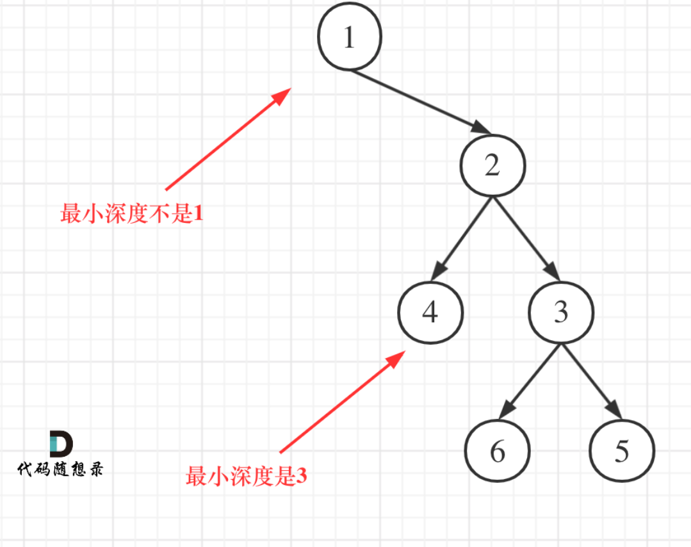

[111. 二叉树的最小深度 - 力扣（LeetCode）](https://leetcode.cn/problems/minimum-depth-of-binary-tree/description/)
题目中说的是：**最小深度是从根节点到最近叶子节点的最短路径上的节点数量。**注意是**叶子节点**，而不是到最近的空节点



```java
class Solution {
    public int minDepth(TreeNode root) {
        if(root==null)
            return 0;
        int leftDepth=minDepth(root.left);
        int rightDepth=minDepth(root.right);
        if(leftDepth==0)
            return 1+rightDepth;
        if(rightDepth==0)
            return 1+leftDepth;
        return 1+Math.min(leftDepth,rightDepth);
    }
}

```

非递归层序
[111. 二叉树的最小深度 - 力扣（LeetCode）](https://leetcode.cn/problems/minimum-depth-of-binary-tree/description/)
```java
class Solution {
    public int minDepth(TreeNode root) {
        Queue<TreeNode> queue=new LinkedList<>();
        if(root==null)
            return 0;
        queue.offer(root);
        int res=0;
        while(!queue.isEmpty()){
            res++;
            //记录此时该层的数量
            int size=queue.size();
            while(size-->0){
                TreeNode node=queue.poll();
                if(node.left==null && node.right==null)
                    return res;
                if(node.left!=null)
                    queue.offer(node.left);
                if(node.right!=null)
                    queue.offer(node.right);
            }
            
        }
        return res;

    }
}
```