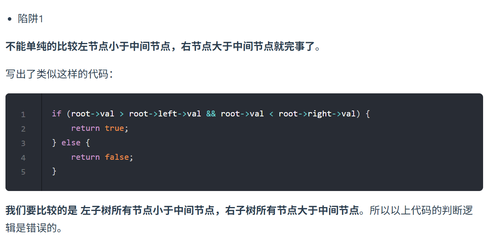

[98. 验证二叉搜索树 - 力扣（LeetCode）](https://leetcode.cn/problems/validate-binary-search-tree/description/)
这种题的陷阱  

1. **看见二叉搜索树就要想到中序遍历有序**
2. **并且需要用到遍历时候前后两个数字时，就要想到中序遍历+双指针**

中序递归
```java
class Solution {
    //使用全局变量的双指针来进行操作
    TreeNode pre;
    public boolean isValidBST(TreeNode root) {
        if(root==null)
            return true;
        boolean left=isValidBST(root.left);
        if(pre!=null && pre.val>=root.val)
            return false;
        pre=root;
        boolean right=isValidBST(root.right);
        return left && right;
        
    }
}
```

迭代法
```java
class Solution {
    //使用全局变量的双指针来进行操作
    public boolean isValidBST(TreeNode root) {
        Stack<TreeNode> stack=new Stack<>();
        if(root==null)
            return true;
        // stack.push(root);不能push两编
        TreeNode pre=null;
        while(!stack.isEmpty() || root!=null){
            if(root!=null){
                stack.push(root);
                root=root.left;
            }
            else{
                root=stack.pop();
                if(pre!=null && pre.val>=root.val)
                    return false;
                pre=root;
                root=root.right;
            }
        }
        return true;
    

    }
}
```
