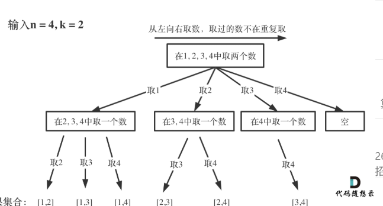

[77. 组合 - 力扣（LeetCode）](https://leetcode.cn/problems/combinations/description/)

递归树如下图所示：


* **每次从集合中选取元素，可选择的范围随着选择的进行而收缩，调整可选择的范围**。
* **发现n相当于树的宽度，k相当于树的深度**。
* 可以理解为：在枚举的过程这种，如果枚举完取1的组合，那么就枚举剩下，也就是从2-4取两个数能够获得的组合。

* **startIndex 就是防止出现重复的组合，也就是树枝上防止出现重复元素**。

剪枝原理：**如果for循环选择的起始位置之后的元素个数 已经不足 我们需要的元素个数了，那么就没有必要搜索了**。

未剪枝版本
```java
//组合未剪枝版本
class Solution {
    //定义全局变量，防止递归函数传入的参数过多
    List<List<Integer>> res=new ArrayList<>();
    List<Integer> path=new ArrayList<>();//存储组合用的，可以抽象成树中的路径
    //1.确定递归函数（回溯函数的参数和返回值），有startIndex是为了控制，第二个元素从当前还未选过的里面选，不能选重复,回溯问题的返回值大多数情况下都是void
    public void backtracking(int n,int k,int startIndex){
        //判断终止条件，并收集结果
        if(path.size()==k){
            res.add(new ArrayList<>(path));//同样的此处不能直接存path，因为这样存的是地址，存结果需要new一个然后存起地址
            return;
        }
        //判断单层递归的逻辑，for循环中线处理节点，再递归，再回溯
        for(int i=startIndex;i<=n;i++){
           path.add(i);
           backtracking(n,k,i+1);
           //回溯
           path.remove(path.size()-1); 
        }
        return ;

    }
    public List<List<Integer>> combine(int n, int k) {
        backtracking(n,k,1);
        return res;
    }
}
```

剪枝版本
```java
class Solution {
    List<List<Integer>> res=new ArrayList<>();
    List<Integer> path=new ArrayList<>();
    public void backtracking(int n,int k,int startIndex){
        if(path.size()==k){
            res.add(new ArrayList(path));
            return ;
        }
        //简直操作，k-path.size()代表还需要的元素的集合，那么列表中剩余的元素n-i+1（因为要包括startIndex）必须>=k-path.size()，所以i<=n-(k-path.size())+1
        //也就是i至多从n-(k-path.size())+1才能取到k个数的集合，后面都不能取到
        for(int i=startIndex;i<=n-(k-path.size())+1;i++){
            path.add(i);
            backtracking(n,k,i+1);
            path.remove(path.size()-1);
        }

    }
    public List<List<Integer>> combine(int n, int k) {
        backtracking(n,k,1);
        return res;
    }
}
```

