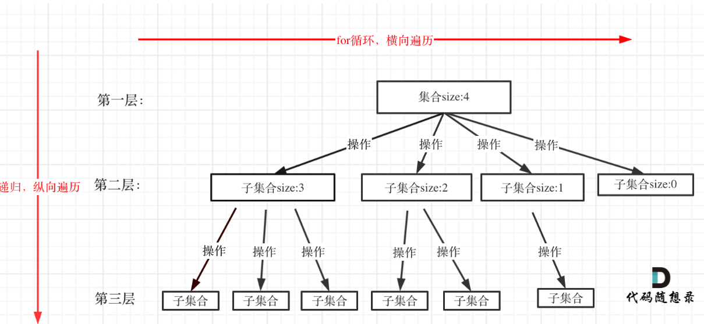
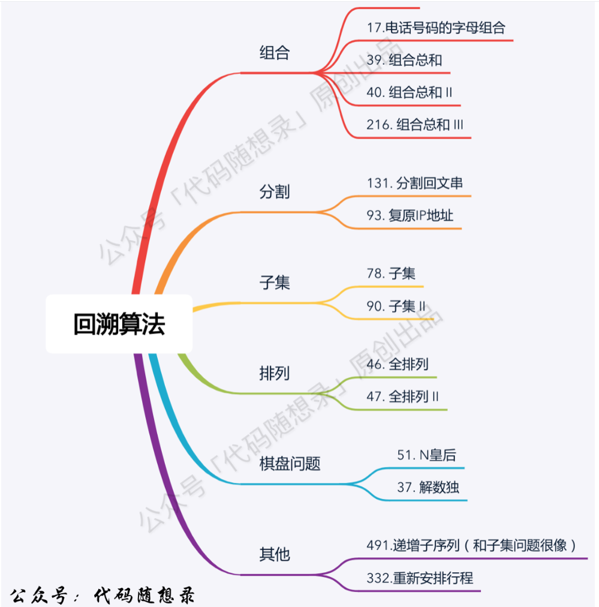
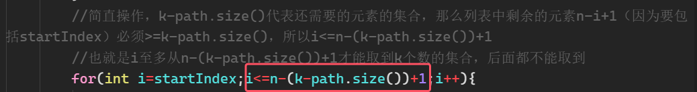
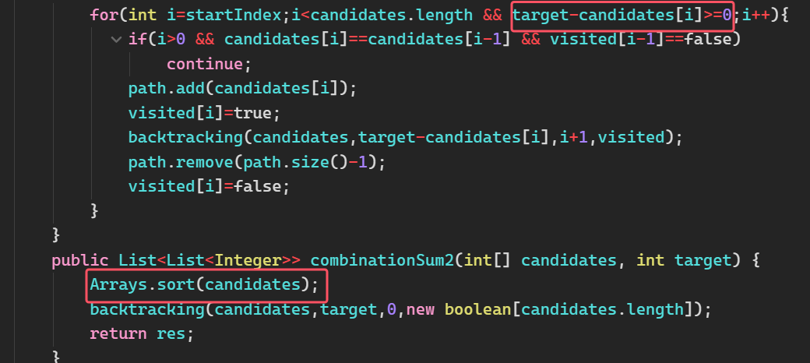
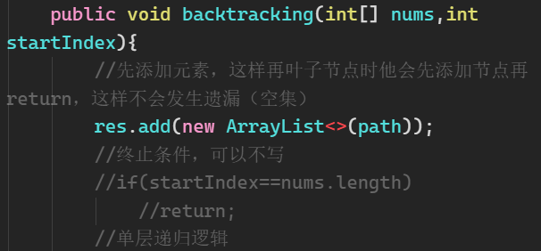
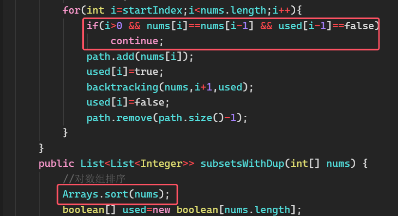

首先要明确，回溯所能解决问题：**使用for循环需要嵌套若干次，就可以使用回溯进行递归，每一层一个递归**

**回溯的效率：回溯的本质是穷举，穷举所有可能，然后选出我们想要的答案。**

**因为穷举本身时间复杂度就很高，所以需要尽量多加剪枝操作来减少穷举次数**

## 回溯三部曲
1. **确定回溯函数返回值以及参数**：回溯法函数名字一般叫backtracking；返回值一般为void，极少数情况为其他；回溯需要的参数很难一次性确定下来，所以一般是先写逻辑，需要什么参数就随时填什么参数
2. **回溯函数终止条件**：从递归树中就可以看出，一般来说搜到叶子节点了，也就找到了满足条件的一条答案，把这个答案存放起来，并结束本层递归。
3. **回溯搜索的遍历过程**：**回溯法一般是在集合中递归搜索，集合的大小构成了树的宽度，递归的深度构成的树的深度**，具体如图所示

	

可以得到如下的递归三部曲模板代码：
```java
void backtracking(参数) {
    if (终止条件) {
        存放结果;
        return;
    }

    for (选择：本层集合中元素（树中节点孩子的数量就是集合的大小）) {
        处理节点;
        backtracking(路径，选择列表); // 递归
        回溯，撤销处理结果
    }
}
```
* 从图中看出**for循环可以理解是横向遍历，backtracking（递归）就是纵向遍历**

## 参数设置的方法论
1. 如果所求问题的结果最后返回值是一个`List<List<?>>`类型，那么就用一个`List<List<?>>`作为最终结果res，一个`List<?>`记录递归之中的结果成分path
2. 如果所求问题的结果最后返回值是一个`List<String>`类型，那么就用一个`List<String>`作为最终结果res，一个`StringBuilder`记录递归之中的结果成分[[07复原ip地址]][[03电话号码的字母组合]]

## 回溯问题总结


### 1.组合问题
[[01组合]]
[[02组合总和3]]
[[03电话号码的字母组合]]
[[04组合总和]]
[[05组合总和2]]

注意点：
1. **组合问题使用startIndex来进行树枝去重，如果每个元素只让用一次，那么每次递归startIndex都为i+1；如果可以使用无限次，那么每次就从i开始**
2.  **对于组合总和的所有问题，都必须要判断当前target<0或者sum>target，来进行剪枝**
3. **如果题目固定是必须要k个数字，那么剪枝原理为：**如果for循环选择的起始位置之后的元素个数 已经不足 我们需要的元素个数了，那么就没有必要搜索了**。所以有以下语句进行进行就剪枝：

	
4. **如果题目未固定是组合是几个数，那么就可以使用排序+在for循环中判断target-nums[i]>=0来剪枝**

	

5. **如果数组中有元素重复，但组合中不能出现重复组合，那么使用==排序+used数组==来进行树层去重**

	


### 2.切割问题
[[06分割回文串]]
[[07复原ip地址]]

注意点：
1. **切割问题类似于组合问题，只不过组合问题的startIndex代表搜索集合的其实位置；而切割问题中startIndex就是切割线（左闭右闭）**
2. **乍一看会觉得两个问题相同，但是切割问题常常会需要多一个函数来判断切割出来的子串是否合法**，并且需要注意**如果不成立时continue还是break，能break就break，这样剪枝提高效率**
3. **注意切割过的位置，不能重复切割，所以必须要有参数startIndex，并且传入下一层的起始位置为i + 1**。

### 3.子集问题
[[08子集]]
[[09子集2]]

注意点：
1. **子集是收集树形结构中树的所有节点的结果**。而组合问题、分割问题是收集树形结构中叶子节点的结果。所以**要在先添加元素，这样再叶子节点时他会先添加节点再return，这样不会发生遗漏（空集）**

	
	
2. **对于集合中有重复元素的，但组合中不能出现重复组合，那么同样使用==排序+used数组==来进行树层去重**

	

### 4.排列问题

不同点：
1. **排列问题和[77.组合问题 (opens new window)](https://programmercarl.com/0077.%E7%BB%84%E5%90%88.html)、[131.切割问题 (opens new window)](https://programmercarl.com/0131.%E5%88%86%E5%89%B2%E5%9B%9E%E6%96%87%E4%B8%B2.html)和[78.子集问题 (opens new window)](https://programmercarl.com/0078.%E5%AD%90%E9%9B%86.html)最大的不同就是for循环里不用startIndex了。**因为排列问题，每次都要从头开始搜索，例如元素1在\[1,2]中已经使用过了，但是在\[2,1]中还要再使用一次1(所以每次单层循环逻辑从0开始)**
2. **一般来说：组合问题和排列问题是在树形结构的叶子节点上收集结果，而子集问题就是取树上所有节点的结果**。
3. **而used数组，其实就是记录此时path里都有哪些元素使用了，一个排列里一个元素只能使用一次**。**如果元素会重复，那么还会用于书树层去重**

### 5.棋盘问题
[[13N皇后]]
[[14解数独]]

注意点:
1. **N皇后问题中，矩阵的高是递归树的深度，矩阵的宽是递归树的宽度；在解数独中，一个for循环遍历棋盘的行，一个for循环遍历棋盘的列，一行一列确定下来之后，递归遍历这个位置放9个数字的可能性！，所以宽度是1-9，而长度的将棋盘填满所需要的数字的数量**
2. **`isValid`函数之中，N皇后检查列只需要遍历到当前节点即可，并且没有在同行进行检查呢？因为在单层搜索的过程中，每一层递归，只会选for循环（也就是同一行）里的一个元素，所以不用去重了；并且已经选为皇后的点只会在当前遍历的点的上方，因为是一行一行选元素**
3. **而在解数独之中，需要将同行同列所有元素都要检查，因为初始的棋盘是有一定与元素的。**
### 其他
[[10非递减子序列]]

注意点：
1. **当题目中透露出不能对源数组进行排序时，就需要想到使用set进行树层去重**