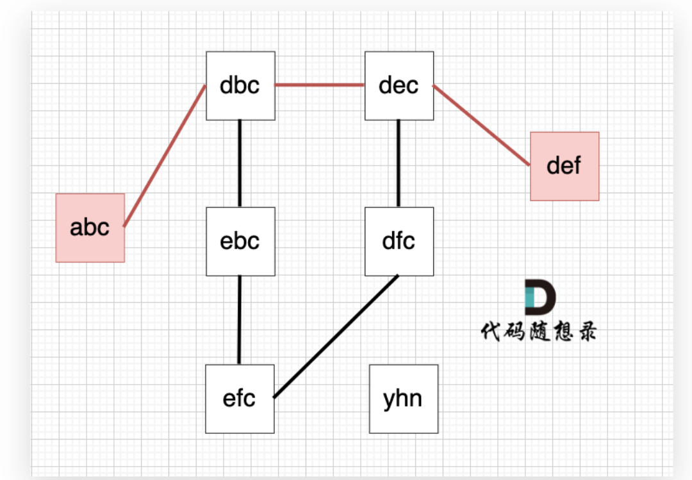

[110. 字符串接龙](https://kamacoder.com/problempage.php?pid=1183)
这道题要解决两个问题：

1、图中的线是如何连在一起的

在搜索的过程中，我们可以枚举，用26个字母替换当前字符串的每一个字符，在看替换后 是否在 strList里出现过，就可以判断 两个字符串 是否是链接的。

2、起点和终点的最短路径长度

首先题目中并没有给出点与点之间的连线，而是要我们自己去连，条件是字符只能差一个。

所以判断点与点之间的关系，需要判断是不是差一个字符，**如果差一个字符，那就是有链接**。

然后就是求起点和终点的最短路径长度，在无权图中，求最短路，用深搜或者广搜就行，没必要用最短路算法。

**在无权图中，用广搜求最短路最为合适，广搜只要搜到了终点，那么一定是最短的路径**。因为广搜就是以起点中心向四周扩散的搜索。

**本题如果用深搜，会比较麻烦，要在到达终点的不同路径中选则一条最短路**。

而广搜只要达到终点，一定是最短路。


```java
import java.util.*;
public class Main{
    //用广搜，广搜只要搜到了终点，那么一定是最短的路径
    public static int bfs(Set<String> set,String begin,String end){
        //用一个map去存遍历道德字符串时对对应的路径长
        Map<String,Integer> map=new HashMap<>();
        //用队列进行广搜
        Deque<String> queue=new ArrayDeque<>();
        map.put(begin,1);
        queue.offer(begin);
        while(!queue.isEmpty()){
            String str=queue.poll();
            //转成字符数组更好操作
            char[] numstr=str.toCharArray();
            for(int i=0;i<numstr.length;i++){
                //先记录改变前的字符，用于还原
                char ch=numstr[i];
                for(int j=0;j<26;j++){
                    numstr[i]=(char)('a'+j);
                    String newstr=new String(numstr);
                    //如果找到了结尾节点
                    if(newstr.equals(end))
                        return map.get(str)+1;
                    //如果在list中又没有遍历过
                    if(set.contains(newstr) && !map.containsKey(newstr)){
                        queue.offer(newstr);
                        map.put(newstr,map.get(str)+1);
                    }
                }
                //还原字符串
                numstr[i]=ch;
            }
        }
        return 0;
    }
    public static void main(String[] main){
        Scanner scanner=new Scanner(System.in);
        int n=scanner.nextInt();
        String begin=scanner.next();
        String end=scanner.next();
        //用一个set去存所有的字符串
        Set<String> set=new HashSet<>();
        //set.add(begin);
        //set.add(end);
        for(int i=0;i<n;i++){
            set.add(scanner.next());
        }
        //System.out.println(scanner.hasNext());
        System.out.println(bfs(set,begin,end));
    }
}
```