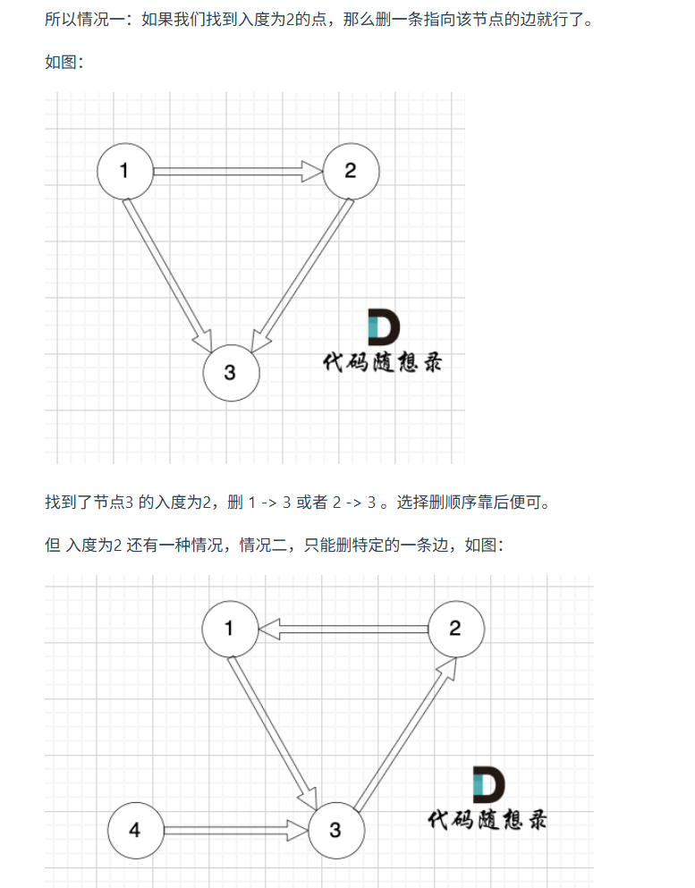
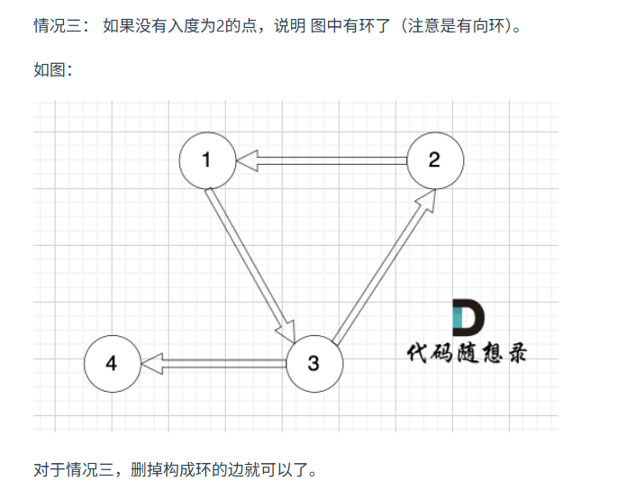
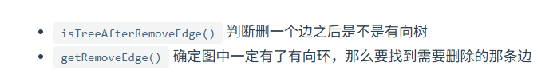

[109. 冗余的边II](https://kamacoder.com/problempage.php?pid=1182)

本题的本质是 ：有一个有向图，是由一颗有向树 + 一条有向边组成的 （所以此时这个图就不能称之为有向树），现在让我们找到那条边 把这条边删了，让这个图恢复为有向树。


有向图更为复杂需要判断三种情况





```java
import java.util.*;
public class Main{
    static int[] father;
    public static void init(){
        for(int i=0;i<father.length;i++){
            father[i]=i;
        }
    }
    public static int find(int u){
        if(father[u]==u)
            return u;
        else{
            father[u]=find(father[u]);
            return father[u];
        }
    }
    public static void join(int u,int v){
        u=find(u);
        v=find(v);
        if(u==v)
            return;
        father[v]=u;
    }
    public static boolean isSame(int u,int v){
        u=find(u);
        v=find(v);
        return u==v;
    }
    public static boolean isTreeAfterRemove(List<int[]> edges,int[] delete){
        init();
        // 判断删一个边之后是不是有向树： 将所有边的两端节点分别加入并查集，遇到要 要删除的边则跳过，如果遇到即将加入并查集的边的两端节点 本来就在并查集了，说明构成了环。
        for(int i=0;i<edges.size();i++){
            if(Arrays.equals(edges.get(i),delete))
                continue;
            if(isSame(edges.get(i)[0],edges.get(i)[1]))
                return false;
            // 如果顺利将所有边的两端节点（除了要删除的边）加入了并查集，则说明 删除该条边 还是一个有向树
            join(edges.get(i)[0],edges.get(i)[1]);
        }
        return true;
    }
    public static void removeEdges(List<int[]> edges){
        // 那么要找到需要删除的那条边： 将所有边的两端节点分别加入并查集，如果遇到即将加入并查集的边的两端节点 本来就在并查集了，说明构成了环。
        init();
        for(int[] nums: edges){
            if(isSame(nums[0],nums[1])){
                System.out.println(nums[0]+" "+nums[1]);
                return;
            }
            join(nums[0],nums[1]);
        }
    }
    public static void main(String[] args){
        Scanner scanner=new Scanner(System.in);
        int n=scanner.nextInt();
        //创建father数组
        father=new int[n+1];
        //存边的列表
        List<int[]> edges=new ArrayList<>();
        //存入度的数组
        int[] indgree=new int[n+1];
        for(int i=0;i<n;i++){
            int s=scanner.nextInt();
            int t=scanner.nextInt();
            edges.add(new int[]{s,t});
            indgree[t]++;
        }
        //因为有向树除了根结点入读为0，其他节点入读为1，所以当从有向树变成有向图的时候，会有三种情况

//情况1和情况2，都是出现了一个入度为2的点，
        //只不过有一种时只能和删除一个，有一种是两个都能删除
        //由于题目让我们删除最后出现的，所有我们只需要判断删除最后一条边看看是不是有向树，如果是那么就是那么就删这个，如果不是，那么就另一个即可

        //判断是否有入度为2的点，并且找到对应的两条有向边
        //并且要么能找到两条边，要么根本找不到（根据按段条件可以得到）

        //存使得成为入读为2的两条边的列表
        //此处时顺序读，所以输入的最后出现的一条边就是第二条
        List<int[]> list=new ArrayList<>(2);
        for(int i=0;i<edges.size();i++){
            if(indgree[edges.get(i)[1]]==2)
                list.add(edges.get(i));
        }

        //如果有入度为2的两条边
        if(list.size()>0){
            //如果删除第二条边后是一个树，那么就和三处第二条，否则删除第一条
            if(isTreeAfterRemove(edges,list.get(1)))
                System.out.println(list.get(1)[0]+" "+list.get(1)[1]);
            else
                System.out.println(list.get(0)[0]+" "+list.get(0)[1]);
            return;
        }
        else
        //否则就是情况三，明确没有入度为2的情况，那么一定有向环，找到构成环的边就是要删除的边。
            removeEdges(edges);


    }

    
}
```