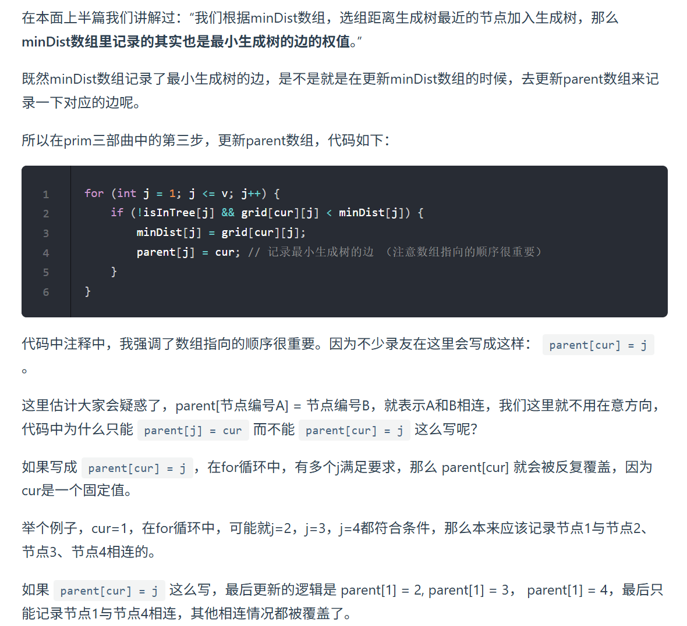

[53. 寻宝（第七期模拟笔试）](https://kamacoder.com/problempage.php?pid=1053)

prim算法是从节点的角度去做最小生成树，
```java
//prim最小生成树算法：是从节点的角度采用贪心的策略每次寻找距离最小生成树最近的节点并加入到最小生成树中。
import java.util.*;
  
public class Main{
    public static void main(String[] args){
        Scanner scanner =new Scanner(System.in);
  
        int v=scanner.nextInt();
        int e=scanner.nextInt();
          
        int[][] grid=new int[v+1][v+1];
        //由于后面要选择最小权值划入生成树之中，所以我们需要将每个元素都先初始化成最大值
        for(int[] i:grid)
            Arrays.fill(i,10001);
        for(int i=0;i<e;i++){
            int begin=scanner.nextInt();
            int end=scanner.nextInt();
            int value=scanner.nextInt();
            //双向图两个方向都要填上
            grid[begin][end]=value;
            grid[end][begin]=value;
        }
        //定义mindist：每一个节点距离最小生成树的最近距离,其实也是最小生成树的边的权值
        int[] minDist=new int[v+1];
        //权值最大为10000，所以初始化所有值为10001
        Arrays.fill(minDist,10001);
  
        //定义是否在树中的数组
        boolean[] isInTree=new boolean[v+1];
  
        //prim的最小生成树每次获得一个生成树节点，所以需要循环v次。
        for(int i=0;i<v;i++){
            //prim三部曲第一步，寻找距离生成树最短的节点,
            int cur=-1;
            //初始化为只要比10001大就行
            int min=Integer.MAX_VALUE;
            for(int j=1;j<=v;j++){
                //选择条件：不在生成树中，并且将距离小于当前设置的最小距离
                if(!isInTree[j] && minDist[j]<min){
                    min=minDist[j];
                    cur=j;
                }
            }
            //我们根据minDist数组，选取距离生成树最近的节点加入生成树，那么minDist数组里记录的其实也是最小生成树的边的权值
  
            //prim三部曲第二步：将该节点划入生成树之中
            isInTree[cur]=true;
  
            //prim三部曲第二步：更新mindistance数组
            for(int j=1;j<=v;j++){
                //更新条件：不在生成树中，并且cur与其连通的权值还小于现在的mindist[j]
                if(!isInTree[j] && grid[cur][j]<minDist[j])
                    minDist[j]=grid[cur][j];
            }
        }
  
        //从2开始遍历，因为上面的程序默认第一个选择的节点是1，他的value根本没有被设置
        int res=0;
        for(int i=2;i<=v;i++){
            res+=minDist[i];
              
        }
        System.out.println(res);
    }
}
```

如果让打印出来最小生成树的每条边呢？或者说要把这个最小生成树画出来呢？，那么改动的代码如下所示。




```java
//prim最小生成树算法：是从节点的角度采用贪心的策略每次寻找距离最小生成树最近的节点并加入到最小生成树中。
import java.util.*;
public class Main{
    public static void main(String[] args){
        Scanner scanner =new Scanner(System.in);
        int v=scanner.nextInt();
        int e=scanner.nextInt();
         
        int[][] grid=new int[v+1][v+1];
        
        for(int[] i:grid)
            Arrays.fill(i,10001);
        for(int i=0;i<e;i++){
            int begin=scanner.nextInt();
            int end=scanner.nextInt();
            int value=scanner.nextInt();
           
            grid[begin][end]=value;
            grid[end][begin]=value;
        }
       
        int[] minDist=new int[v+1];
       
        Arrays.fill(minDist,10001);
     
        boolean[] isInTree=new boolean[v+1];

        //定义存储最小生成树边的数组,初始化每条边的父亲节点是自己
        int[] parent=new int[v+1];

       
        for(int i=0;i<v;i++){
            //prim三部曲第一步，寻找距离生成树最短的节点,
            int cur=-1;
           
            int min=Integer.MAX_VALUE;
            for(int j=1;j<=v;j++){
               
                if(!isInTree[j] && minDist[j]<min){
                    min=minDist[j];
                    cur=j;
                }
            }
           
            isInTree[cur]=true;
            
            for(int j=1;j<=v;j++){
             
                if(!isInTree[j] && grid[cur][j]<minDist[j]){
                    minDist[j]=grid[cur][j];
                    //注意这里一定是j的父亲节点是cur，顺序不能颠倒
                    parent[j]=cur;
                }
                    
            }
        }
        //从2开始遍历，因为上面的程序默认第一个选择的节点是1，他的value根本没有被设置
        int res=0;
        for(int i=2;i<=v;i++){
            res+=minDist[i];
             
        }

        //输出最小生成树的每条边
        for(int i=2;i<=v;i++){
            System.out.println(parent[i]+"->"+i);
        }
        System.out.println(res);
    }
}
```