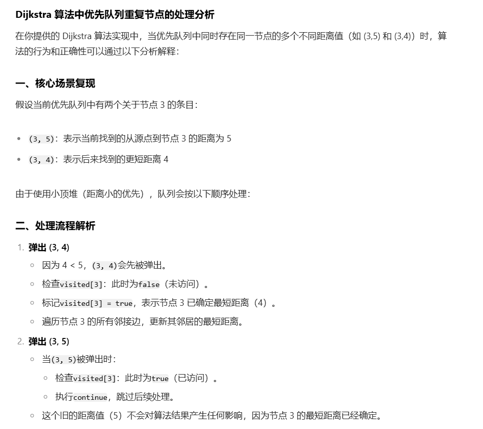

[47. 参加科学大会（第六期模拟笔试）](https://kamacoder.com/problempage.php?pid=1047)
堆优化版是从边的角度去考虑，而朴素版本是从节点的角度去考虑问题。


需要定义一个edge，存节点和权值，因为普通邻接表没办法存权值，所以用一个class edge去存节点和权值；还需要class 去存当前节点以及距离源点的最小距离，因为最小堆是根据这个最小距离进行排序。

思路依然是 dijkstra 三部曲：
1. 第一步，选源点到哪个节点近且该节点未被访问过。**在堆优化版本是是利用一个小顶堆，根据节点离源点的最短距离排序，那么每次从堆顶取出来的边就是最小边**
2. 第二步，该最近节点被标记访问过
3. 第三步，更新非访问节点到源点的距离（即更新minDist数组）



```java
import java.util.*;
//dijstra算法的堆优化版
//由于邻接表没有办法存权值，所以让邻接表的链表节点中存一个edge
class Edge{
    public int to;//链接的顶点
    public int val;//对应边的权值
    public Edge(int to,int val){
        this.to=to;
        this.val=val;
    }
}
//存的是当前节点和具体源点的距离
class Pair{
    public int first;//结点
    public int second;//距离源点的距离
    public Pair(int first,int second){
        this.first=first;
        this.second=second;
    }
}
public class Main{
    public static void main(String[] args){
        Scanner scanner=new Scanner(System.in);
        int n=scanner.nextInt();
        int m=scanner.nextInt();
        //新建邻接表
        List<List<Edge>> graph=new ArrayList<>(n+1);
        //初始化邻接表
        for(int i=0;i<=n;i++){
            graph.add(new LinkedList<Edge>());
        }
        //读取邻接表
        while(m-->0){
            int s=scanner.nextInt();
            int t=scanner.nextInt();
            int k=scanner.nextInt();
            graph.get(s).add(new Edge(t,k));
        }
        //自定义小顶堆：按照当前节点与源点路径进行排序，并且不能用lambda表达式，因为他性能很差，用了的话会超时
        Queue<Pair> queue=new PriorityQueue<>(new Comparator<Pair>(){
            @Override
            public int compare(Pair s1,Pair s2){
                return s1.second-s2.second;
            }
        });
        //定义起点终点
        int start=1;
        int end=n;
        //定义mindist：该点离源点的最短距离
        int[] mindist=new int[n+1];
        Arrays.fill(mindist,Integer.MAX_VALUE);
        //标记数组visited
        boolean[] visited=new boolean[n+1];
        //从节点1开始
        mindist[start]=0;
        queue.offer(new Pair(1,0));
        while(!queue.isEmpty()){
            //第一步：选择距离源点最近的节点
            Pair cur=queue.poll();
            //如果当前边已经被标记过那么就continue;必须要有这个，不然会超时
            if(visited[cur.first])
                continue;
            //第二步：标记对应的节点为已经遍历
            visited[cur.first]=true;
            //第三步：更新节点与源点的距离
            for(Edge edge:graph.get(cur.first)){
                if(!visited[edge.to] && edge.val+mindist[cur.first]<mindist[edge.to]){
                     mindist[edge.to]=edge.val+mindist[cur.first];
                    queue.offer(new Pair(edge.to,mindist[edge.to]));
                }
            }
        }
        if(mindist[n]==Integer.MAX_VALUE)
            System.out.println(-1);
        else
            System.out.println(mindist[n]);
    }
}
```
