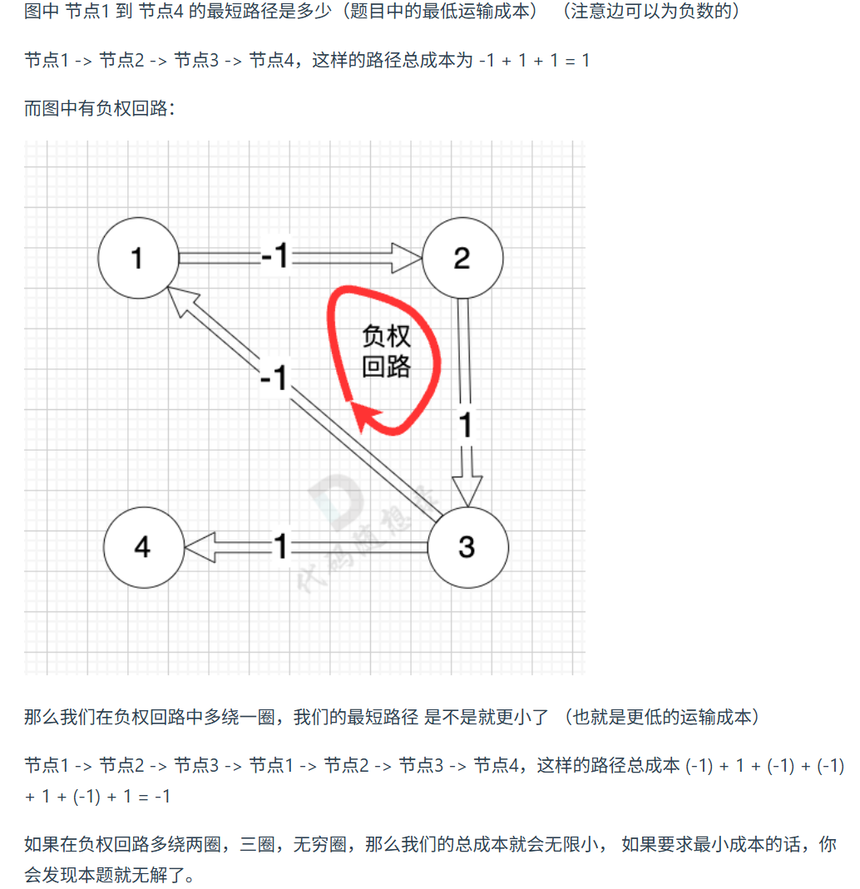

[95. 城市间货物运输 II](https://kamacoder.com/problempage.php?pid=1153)



```java
import java.util.*;
// 在 bellman_ford 算法中，松弛 n-1 次所有的边 就可以求得 起点到任何节点的最短路径，松弛 n 次以上，minDist数组（记录起到到其他节点的最短距离）中的结果也不会有改变
public class Main{
    public static void main(String[] args){
        Scanner scanner=new Scanner(System.in);
        int n=scanner.nextInt();
        int m=scanner.nextInt();
        List<int[]> edges=new ArrayList<>();
        while(m-->0){
            int s=scanner.nextInt();
            int t=scanner.nextInt();
            int val=scanner.nextInt();
            edges.add(new int[]{s,t,val});
        }
        int[] mindist=new int[n+1];
        Arrays.fill(mindist,Integer.MAX_VALUE);
        mindist[1]=0;
        boolean flag=false;
        // 而本题有负权回路的情况下，一直都会有更短的最短路，所以 松弛 第n次，minDist数组 也会发生改变。那么解决本题的 核心思路，就是在 的基础上，再多松弛一次，看minDist数组 是否发生变化。
        for(int i=1;i<=n;i++){
            for(int[] arr:edges){
                int s=arr[0];
                int t=arr[1];
                int val=arr[2];
                if(i<n){
                    if(mindist[s]!=Integer.MAX_VALUE&&  mindist[t]>mindist[s]+val)
                        mindist[t]=mindist[s]+val;
                }else{
                    // 多加一次松弛判断负权回路,如果第n次有改变，说明有负全回路
                    if(mindist[s]!=Integer.MAX_VALUE&& mindist[t]>mindist[s]+val)
                        flag=true;
                }
                 
            }
        }
        if(flag)
            System.out.println("circle");
        else if(mindist[n]==Integer.MAX_VALUE)
            System.out.println("unconnected");
        else  
            System.out.println(mindist[n]);
         
    }
}
```