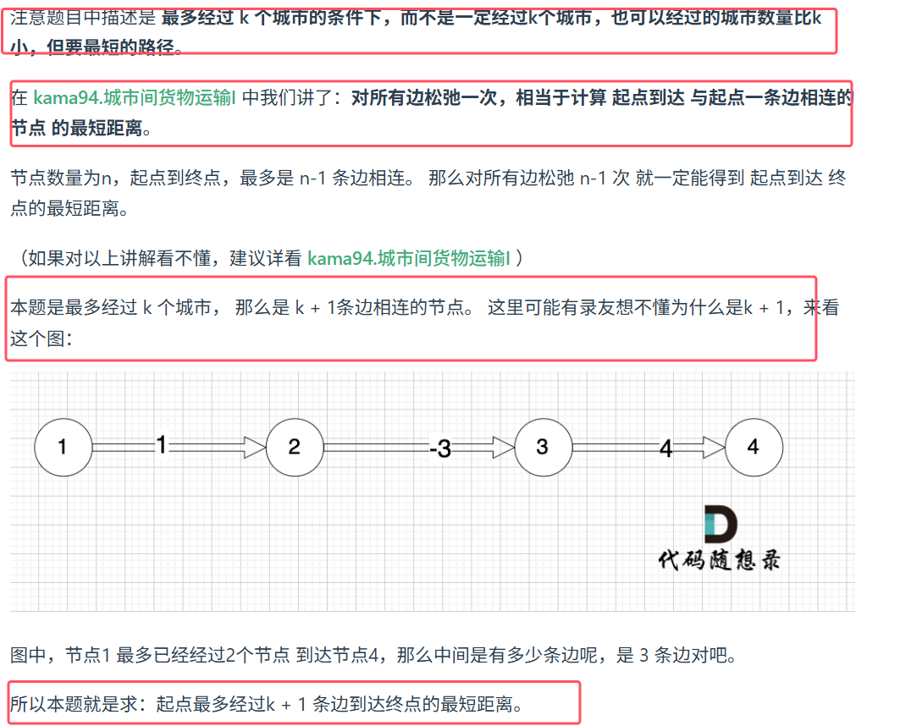

* **由上图可知，bellman_ford 标准写法是松弛 n-1 次，本题就松弛 k + 1次就好。**
* 并且由于题目输入边的顺序的不确定性，可能松弛第一次的过程不仅与起点一条边相连的节点更新了，所有节点都更新了。
* **所以为了让至少经过k个节点的条件能够限制住，所以在每次计算 minDist 时候，要基于 对所有边上一次松弛的 minDist 数值才行，所以我们要记录上一次松弛的minDist**，也就是下图的意思

	


朴素bellman_ford算法如下
```java
import java.util.*;
  
public class Main{
    public static void main(String[] args){
        Scanner scanner=new Scanner(System.in);
  
        int n=scanner.nextInt();
        int m=scanner.nextInt();
  
         
        List<int[]> graph=new ArrayList<>();
        while(m-->0){
            int s=scanner.nextInt();
            int t=scanner.nextInt();
            int val=scanner.nextInt();
            graph.add(new int[]{s,t,val});
        }
        //输入起点和终点和经过的k个诚实
        int src=scanner.nextInt();
        int dest=scanner.nextInt();
        int k=scanner.nextInt();
        
        int[] mindist=new int[n+1];
        // 用来记录上一次松弛的mindist
        int[] mindist_copy=new int[n+1];
        
        Arrays.fill(mindist,Integer.MAX_VALUE);
        mindist[src]=0;
  
       
        for(int i=1;i<=k+1;i++){
            // 获取上一次计算的结果
            mindist_copy=Arrays.copyOf(mindist,n+1);
            for(int[] arr:graph){
                int from=arr[0];
                int to=arr[1];
                int val=arr[2];
              // 注意使用 minDist_copy 来计算 minDist ，每一轮中，可能由多条边指向to这个节点，所以在比较的时候需要用新的mindist[to]
                if(mindist_copy[from]!=Integer.MAX_VALUE && mindist[to]>mindist_copy[from]+val)
                    mindist[to]=mindist_copy[from]+val;
            }
        }
  
        if(mindist[dest]==Integer.MAX_VALUE)
            System.out.println("unreachable");
        else
            System.out.println(mindist[dest]);
    }
}
```


队列优化版代码
```java
import java.util.*;
//队列优化版bellman_ford解决单源最短路径
class Edge{
    int to;
    int val;
    public Edge(int to,int val){
        this.to=to;;
        this.val=val;
    }
}
public class Main{
    public static void main(String[] args){
        Scanner scanner=new Scanner(System.in);
        int n=scanner.nextInt();
        int m=scanner.nextInt();
        //使用邻接表去接
        List<List<Edge>> graph=new ArrayList<>(n+1);
        for(int i=0;i<n+1;i++){
            graph.add(new LinkedList<>());
        }
        while(m-->0){
            int s=scanner.nextInt();
            int t=scanner.nextInt();
            int val=scanner.nextInt();
            graph.get(s).add(new Edge(t,val));
        }

        //输入起点和终点和经过的k个诚实
        int src=scanner.nextInt();
        int dest=scanner.nextInt();
        int k=scanner.nextInt();
        //经过k个城市需要经过k+1条边
        k++;
       
        int[] mindist=new int[n+1];
        //同样使用该数组记录上一次松弛的数组
        int[] mindist_copy;
        Arrays.fill(mindist,Integer.MAX_VALUE);
        mindist[src]=0;

        Deque<Integer> queue=new ArrayDeque<>();
        queue.offer(src);
        //控制松弛k次：可以用一个变量 que_size 记录每一轮松弛入队列的所有节点数量。
        while(k-->0 && !queue.isEmpty()){
            //记录上次入队列的节点个数
            int size=queue.size();
            // 每一轮松弛中，控制节点不用重复入队列，避免节点重复计算
            boolean[] visited=new boolean[n+1];
            mindist_copy=Arrays.copyOf(mindist,n+1);
            // 下一轮松弛的时候，就把队列里 que_size 个节点都弹出来，就是上一轮松弛入队列的节点。
            // 上一轮松弛入队列的节点，这次对应的边都要做松驰
            while(size-->0){
                int node=queue.poll();
                for(Edge edge:graph.get(node)){
                    if(mindist[edge.to]>edge.val+mindist_copy[node]){
                        mindist[edge.to]=edge.val+mindist_copy[node];
                        if(visited[edge.to]==false){
                            queue.offer(edge.to);
                            visited[edge.to]=true;
                        }
                    }
                }
            }
        }

        if(mindist[dest]==Integer
```