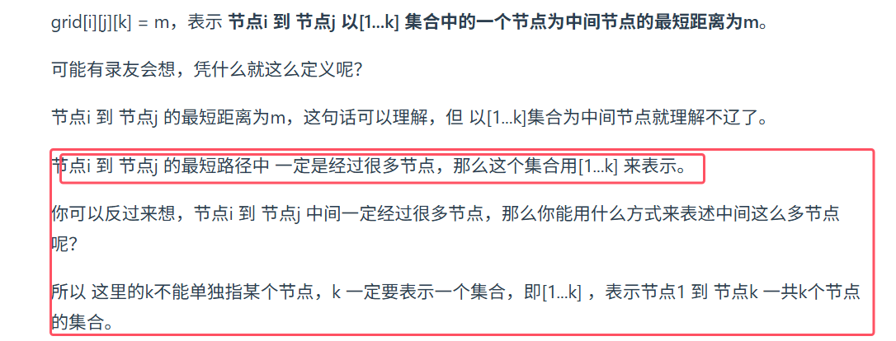
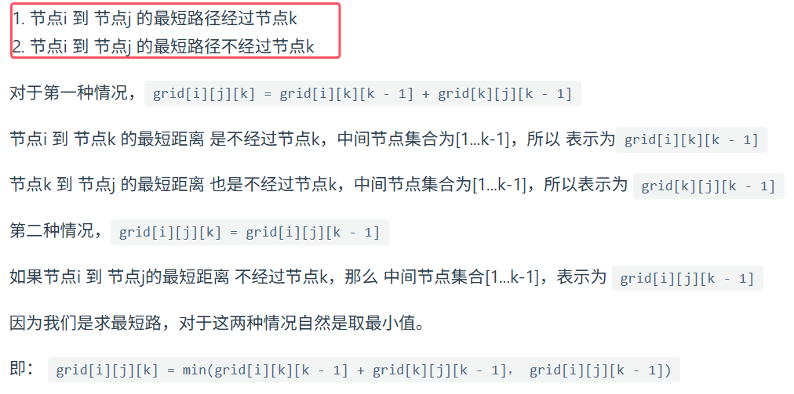
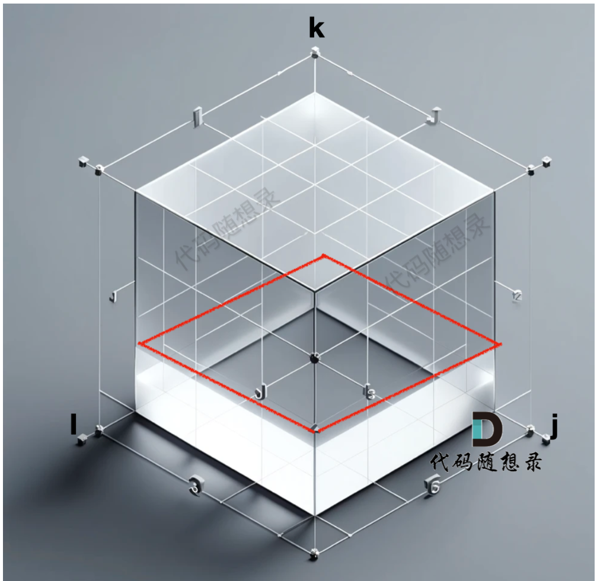
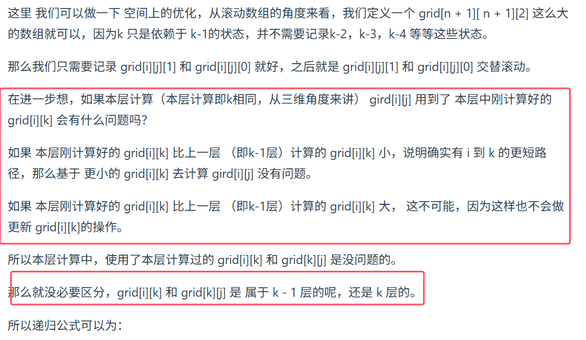

**Floyd 算法对边的权值正负没有要求，都可以处理，单不能有负权回路**。

**floyd算法得本质是动态规划**



* **初始化为第一层**


```java
import java.util.*;
/**
 *   基于三维数组的floyd算法
 */
public class Main{
    public static void main(String[] args){
        Scanner scanner=new Scanner(System.in);
        int n=scanner.nextInt();
        int m=scanner.nextInt();
        //floyd算法实际上就是动态规划，
        //dp数组定义：节点i 到 节点j 以[1...k] 集合中的一个节点为中间节点的最短距离为m。dp[i][j][k]
        //根据递推公式可以得到，初始化为邻接矩阵，并且初始化得是最底下一层即m=0，所以直接使用邻接矩阵作为dp数组
        int[][][] graph=new int[n+1][n+1][n+1];
        //要对邻接矩阵中初始化为最大值即可
        for(int i=0;i<=n;i++){
            for(int j=0;j<=n;j++){
                for(int k=0;k<=n;k++){
                    graph[i][j][k]=Integer.MAX_VALUE;
//                    System.out.println(graph[i][j][k]);
                }
            }
        }
        while(m-->0){
            int s=scanner.nextInt();
            int t=scanner.nextInt();
            int val=scanner.nextInt();
            //双向图
            graph[s][t][0]=val;
            graph[t][s][0]=val;
        }
        //开启floyd
        for(int k=1;k<=n;k++){
            for(int i=1;i<=n;i++){
                for(int j=1;j<=n;j++){
                    //递推公式：节点i 到 节点j 的最短路径经过节点k,节点i 到 节点j 的最短路径不经过节点k
                    //初始化为最大值，要考虑溢出,
                    //如果graph[i][k][k-1] graph[k][j][k-1]其中由一个溢出，那么就继承原来得值
                    if((graph[i][k][k-1]!=Integer.MAX_VALUE && graph[k][j][k-1]!=Integer.MAX_VALUE))
                        graph[i][j][k]=Math.min(graph[i][k][k-1]+graph[k][j][k-1],graph[i][j][k-1]);
                    else
                        graph[i][j][k]=graph[i][j][k-1];
                }
            }
        }
        int q=scanner.nextInt();
        while(q-->0){
            int start=scanner.nextInt();
            int end=scanner.nextInt();
            if(graph[start][end][n]!=Integer.MAX_VALUE)
                System.out.println(graph[start][end][n]);
            else
                System.out.println(-1);
        }
    }
}
```


状态压缩版floyd


```java
import java.util.*;
/**
 *   基于二维数组的floyd算法
 */
public class Main{
    public static void main(String[] args){
        Scanner scanner=new Scanner(System.in);
        int n=scanner.nextInt();
        int m=scanner.nextInt();
        //floyd算法实际上就是动态规划，
        //dp数组定义：节点i 到 节点j 以[1...k] 集合中的一个节点为中间节点的最短距离为m。dp[i][j][k]
        int[][] graph=new int[n+1][n+1];
        //要对邻接矩阵中初始化为最大值即可
        for(int i=0;i<=n;i++){
            for(int j=0;j<=n;j++){
                graph[i][j]=Integer.MAX_VALUE;
            }
        }
        while(m-->0){
            int s=scanner.nextInt();
            int t=scanner.nextInt();
            int val=scanner.nextInt();
            //双向图
            graph[s][t]=val;
            graph[t][s]=val;
        }
        //开启floyd
        for(int k=1;k<=n;k++){
            for(int i=1;i<=n;i++){
                for(int j=1;j<=n;j++){
                    //初始化为最大值，要考虑溢出,
                    //如果graph[i][k][k-1] graph[k][j][k-1]其中由一个溢出，那么就继承原来得值,会自动继承原值，所以不用else
                    if((graph[i][k]!=Integer.MAX_VALUE && graph[k][j]!=Integer.MAX_VALUE))
                        graph[i][j]=Math.min(graph[i][k]+graph[k][j],graph[i][j]);
                }
            }
        }
        int q=scanner.nextInt();
        while(q-->0){
            int start=scanner.nextInt();
            int end=scanner.nextInt();
            if(graph[start][end]!=Integer.MAX_VALUE)
                System.out.println(graph[start][end]);
            else
                System.out.println(-1);
        }
    }
}
```


