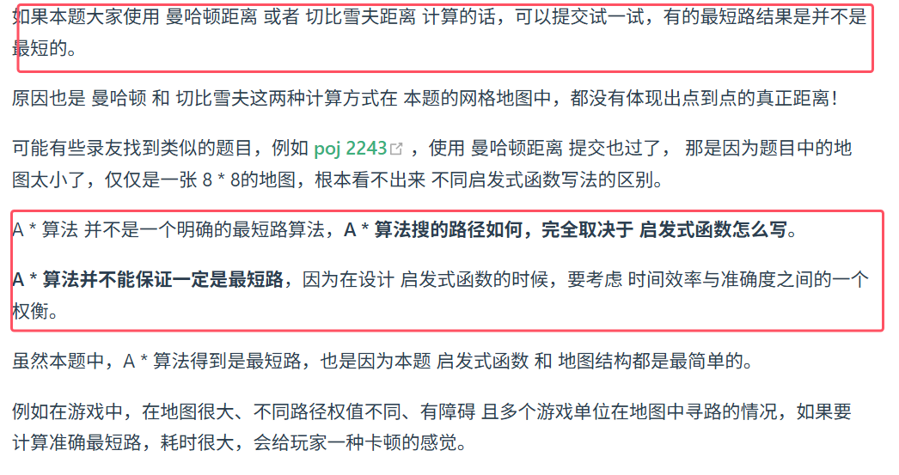

**Astar 是一种广搜的改良版。Astar 关键在于 启发式函数引导我们遍历遍历得方向是朝着终点方向遍历，即影响广搜中从队列中弹出得顺序**，这是影响BFS搜索方向的关键。

对队列里节点进行排序，就需要给每一个节点权值，如何计算权值呢？

**每个节点的权值为F，给出公式为：F = G + H
G：已经走过的距离，而不是起点距离当前遍历节点得距离
H：目前遍历的节点到达终点的距离**

起点达到目前遍历节点的距离 + 目前遍历的节点到达终点的距离 就是起点到达终点的距离。

本题的图是无权网格状，在计算两点距离通常有如下三种计算方式：
1. 曼哈顿距离，计算方式： d = abs(x1-x2)+abs(y1-y2)
2. 欧氏距离（欧拉距离） ，计算方式：d = sqrt( (x1-x2)^2 + (y1-y2)^2 )
3. 切比雪夫距离，计算方式：d = max(abs(x1 - x2), abs(y1 - y2))
x1, x2 为起点坐标，y1, y2 为终点坐标 ，abs 为求绝对值，sqrt 为求开根号，选择哪一种距离计算方式 也会导致 A * 算法的结果不同。

本题，采用欧拉距离才能最大程度体现 点与点之间的距离。


```java
import java.util.*;
class Node{
    int x;
    int y;
    //距离起点得路径长
    int begindist;
    //距离终点得路径长
    int enddist;
    //总路径长
    int distance;
    public Node(int x,int y){
        this.x=x;
        this.y=y;
    }
}
public class Main{
    static int[][] ways={{-2,-1},{-1,-2},{1,-2},{2,-1},{1,2},{2,1},{-1,2},{-2,1}};
    static int[][] move=new int[1000+1][1000+1];
    static Queue<Node> queue;
    public static int calculate(Node first,Node second){
        //计算欧几里得距离，不用开根号简化运算，也能体现权值
        return (first.x-second.x)*(first.x-second.x)+(first.y-second.y)*(first.y-second.y);
    }
    public static int Astar(int beginx,int beginy,int endx,int endy){
        Node begin=new Node(beginx,beginy);
        Node end=new Node(endx,endy);
        begin.begindist=0;
        begin.enddist=calculate(begin,end);
        begin.distance=begin.enddist;
        //初始化最短步数
        move[beginx][beginy]=0;
        queue.offer(begin);
        while(!queue.isEmpty()){
            Node node=queue.poll();
            //如果遇到了终点,那么就退出
            if(node.x==endx && endy==node.y)
                return move[node.x][node.y];
            for(int i=0;i<8;i++){
                int nextx=node.x+ways[i][0];
                int nexty=node.y+ways[i][1];
                if(nextx<=0 || nextx>=1001 ||nexty<=0 || nexty>=1001 )
                    continue;
                //防止跳到已经跳到得节点
                if(move[nextx][nexty]==0){
                    //入队列的时候更新步数
                    move[nextx][nexty]=move[node.x][node.y]+1;
                    Node next=new Node(nextx,nexty);
                    //计算距离
                    //注意这里并不是计算起点与当前节点得距离，而是计算已经走了得距离
                    next.begindist=node.begindist+5;
                    next.enddist=calculate(next,end);
                    next.distance=next.begindist+next.enddist;
                    queue.offer(next);
                }
            }
        }
        return move[endx][endy];
    }
    public static void main(String[] args){
        Scanner scanner=new Scanner(System.in);
       int n=scanner.nextInt();
        //初始化优先级队列,lambda表达式耗时大
        queue=new PriorityQueue<>(new Comparator<Node>(){
            @Override
            public int compare(Node s1,Node s2){
                return s1.distance-s2.distance;
            }
        });
        while(n-->0){
            int beginx=scanner.nextInt();
            int beginy=scanner.nextInt();
            int endx=scanner.nextInt();
            int endy=scanner.nextInt();
            //清空队列，清空move数组
            for(int[] i:move)
                Arrays.fill(i,0);
            queue.clear();
            System.out.println(Astar(beginx,beginy,endx,endy));
        }
    }
}```